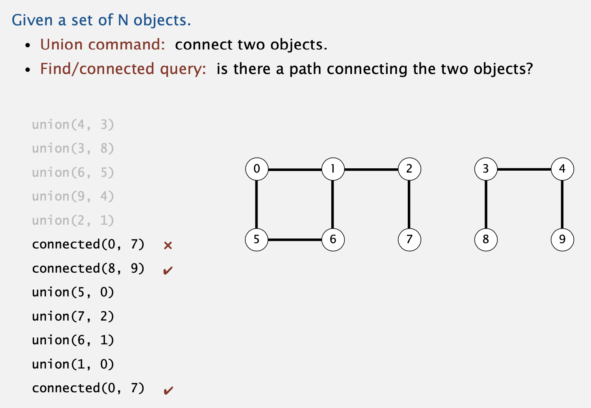

---

---

# Union-Find

## 1. Dynamic Connectivity

### 1.1 Steps to developing a usable algorithm.

- Model the problem.
- Find an algorithm to solve it.
- Fast enough? Fits in memory?
- If not, figure out why.
- Find a way to address the problem. 
- Iterate until satisfied.

### 1.2 Dynamic Connectivity



#### 1.2.1 Modeling the connections

We assume **"is connected to"** is an equivalence relation:

- **Reflexive:** *p* is connected to *p*.
- **Symmetric:** if *p* is connected to *q*, then *q* is connected to *p*. 
- **Transitive:** if *p* is connected to *q* and *q* is connected to *r*, then *p* is connected to *r*.

**Connected components.** 

Maximal set of objects that are mutually connected.


#### 1.2.2 Implementing the operations

**Find query.** Check if two objects are in the same component.

**Union command.** Replace components containing two objects

with their union.


#### 1.2.3 Union-find data type (API)


#### 1.2.4 Dynamic-connectivity client

- Read in number of objects *N* from standard input. 

- Repeat:
  - –  read in pair of integers from standard input
  - –  if they are not yet connected, connect them and print out pair


### 1.3 Quick Find

#### **1.3.1  Data Structure**.

- Integer array `id[]` of length N.

- Interpretation: `p` and `q` are connected iff they have the same id.

If the two numbers are connected, put the same index to their id, like the picture, 0,5,6 have the same index of 0 because the are connected.


#### 1.3.2 Find.

Check if `p` and `q` have the same id.

#### 1.3.3 Union. 

To merge components containing `p` and `q`, change all entries whose id equals `id[p]` to `id[q]`.


#### 1.3.4 Java Implementation.

```java
public class QuickFindUF{
  private int[] id;
  
  public QickFindUF(int N){
    id = new int[N];
    for(int i=0; i<N;i++){
      id[i] = i;
    }
  }
  public boolean connected(int p, int q){
    return id[p]==id[q];
  }
  public void union(int p, int q){
    int pid = id[p];
    int qid = id[q];
    for(int i=0; i<id.length;i++){
      if(id[i] == pid) id[i]=qid;
    }
  }
}
```

#### 1.3.5 Cost model.


#### 1.3.6 Union is too expensive.

It takes $N^2$ array accesses to process a sequence of $N$ union commands on $N$ objects.

### 1.4 Quick Union

#### 1.4.1 Data Structure.


#### 1.4.2 Find. 

Check if `p` and `q` have the same **root**.

#### **1.4.3 **Union**. **

To merge components containing `p` and `q`, set the `id` of `p`'s root to the id of `q`'s root.


#### 1.4.4 Java Implementation.

```java
public class QuickUnionUF{
  private int[] id;
  
  public QuickUnionUF(int N){
    id = new int[N];
    for(int i=0;i<N;i++) id[i] = i;
  }
  
  private int root(int i){
    while(id[i] != i) i = id[i];
    return i;
  }
  
  public boolean connected(int p, int q){
    return root(p) == root(q);
  }
  
  public void union( int p, int q){
    int i = root(p);
    int j = root(q);
    id[i] = j;
  }
}
```

#### 1.4.5 Cost model.


#### 1.4.6 Quick-find defect.

- Union too expensive (*N* array accesses).
- Trees are flat, but too expensive to keep them flat.

#### 1.4.7 Quick-union defect.

- Trees can get tall.
- Find too expensive (could be *N* array accesses).

### 1.5 Improvements

#### 1.5.1 Improvement 1: weighting

- Modify quick-union to **avoid tall trees**.
- Keep track of size of each tree (number of objects).
- Balance by linking root of smaller tree to root of larger tree.

#### **1.5.2 Weighted quick-union: Java implementation**

Keep track of size and update the new size of trees.

- Link root of smaller tree to root of larger tree. 
- Update the `sz[]` array.

```java
if (i == j) return;
if  (sz[i] < sz[j]) { id[i] = j; sz[j] += sz[i]; }
else                { id[j] = i; sz[i] += sz[j]; }
```

#### 1.5.3 Weighted quick-union analysis

**Proposition.** Depth of any node *x* is at most .

**Pf.** When does depth of *x* increase?

Increases by 1 when tree containing *x* is merged into another tree .

- The size of the tree containing *x* at least doubles since | | ≥ ||.
- Size of tree containing *x* can double at most lg *N* times. Why?

When  add to , the size of  doubled and consider about *N* that means  


