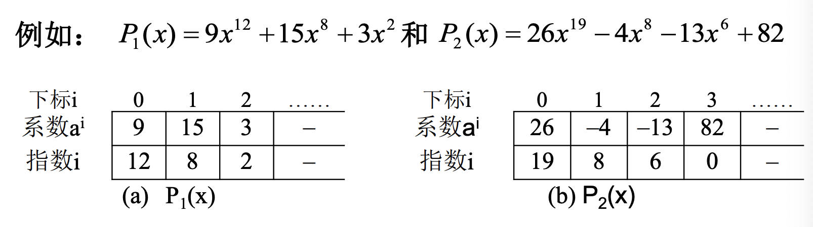
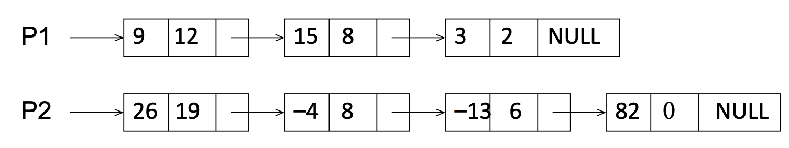

# Chapter 2

## 1. 多项式的表示

### 方法1：顺序存储结构直接表示

### 方法2：顺序存储结构表示非零项

### 方法3：链表结构存储非零项

## 2. 线性表

**“线性表(Linear List)”**：由同类型数据元素构成有序序列的线性结构

- 表中元素个数称为线性表的**长度**

- 线性表没有元素时，称为**空表**

- 表起始位置称**表头**，表结束位置称**表尾**

## 3. 堆栈

**应用场景：**后缀表达式求值

**堆栈(Stack)：**具有一定操作约束的线性表

- 只在一端(栈顶，Top)做插入、删除
- 插入数据：入栈(Push)
- 删除数据：出栈(Pop)
- 后入先出：Last In First Out(LIFO)

**栈的顺序存储实现**

由一个一维数组和一个记录 栈顶元素位置的变量组成。

**扩展：单数组实现两个堆栈**

一种比较聪明的方法是使这两个栈分别从数组的两头开始 向中间生长;当两个栈的栈顶指针相遇时，表示两个栈都满了。

**堆栈的链式存储实现**

栈的链式存储结构实际上就是一个单链表，叫做**链栈**。插入和删 除操作只能在链栈的**栈顶**进行。

**堆栈应用:表达式求值**

**中缀表达式如何转换为后缀表达式**

- 从头到尾读取中缀表达式的每个对象，对不同对象按不同的情况处理。
  - 运算数:直接输出;
  - 左括号:压入堆栈;
  - 右括号:将栈顶的运算符弹出并输出，直到遇到左括号(出栈，不输出); 
  - 运算符:
    - 若优先级大于栈顶运算符时，则把它压栈;
    - 若优先级小于等于栈顶运算符时，将栈顶运算符弹出并输出;再比较新的栈顶运算符，直到该运算符大于栈顶运算符优先级为止，然后将该运算符压栈;若各对象处理完毕，则把堆栈中存留的运算符一并输出。

## 4. 队列

- 特点：一端插入，另一端删除，“先进先出”

**队列的顺序存储实现**

队列的顺序存储结构通常由一个一维数组和一个记录队列头元 素位置的变量front以及一个记录队列尾元素位置的变量rear组成。

Add的时候先动rear指针，Delete的时候先删除再动front指针

**顺环队列**

队列首尾相连形成一个环状结构

循环队列空：rear=front

循环队列满：front=rear%maxsize

**队列的链式存储实现**

队列的链式存储结构也可以用一个单链表实现。插入和删除操作 分别在链表的两头进行，**插入在链表头部，删除在链表尾部**

## 5.应用：多项式加法运算

主要思路:相同指数的项系数相加，其余部分进行拷贝。

两条链表，每个节点存储两个信息：系数和指数，指数相等系数相加，指数不等时系数小的后移并记录当前系数。